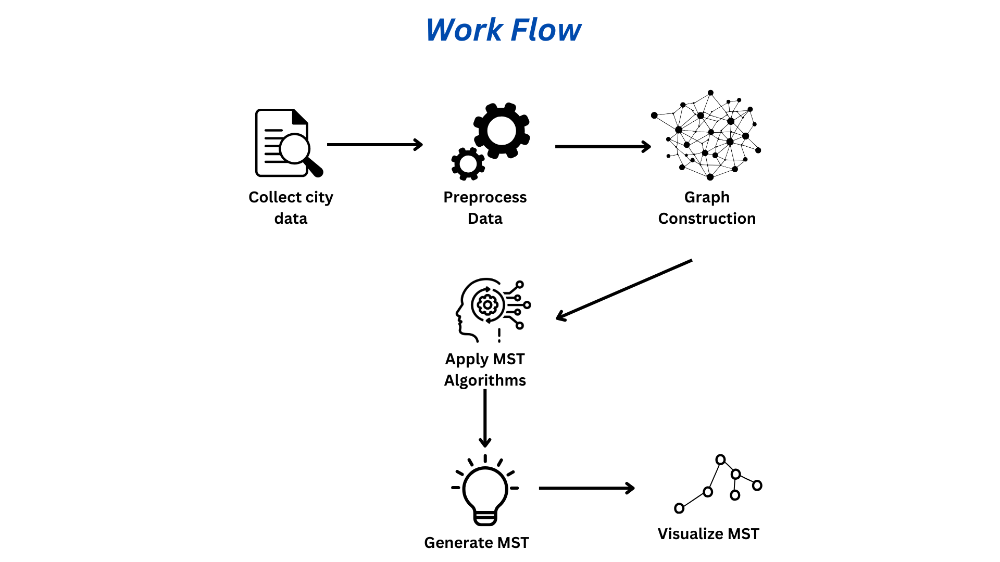
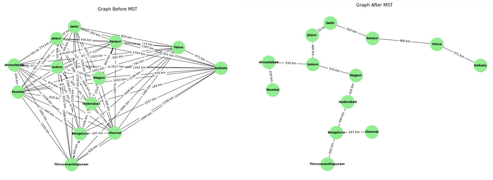
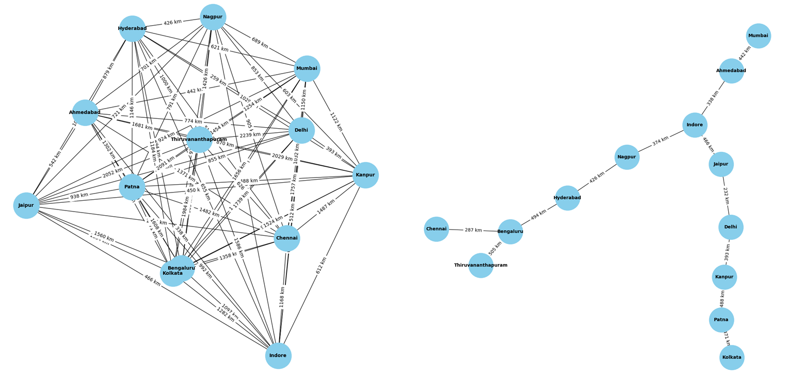
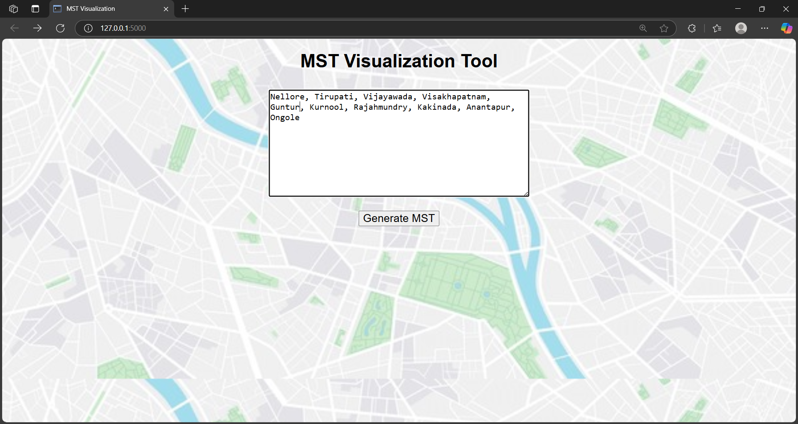
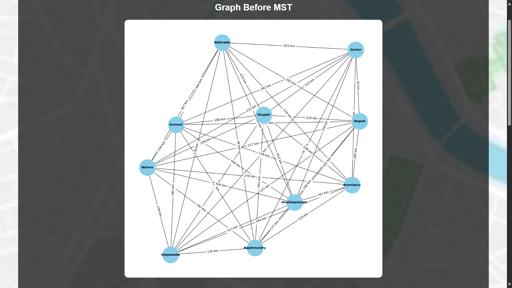
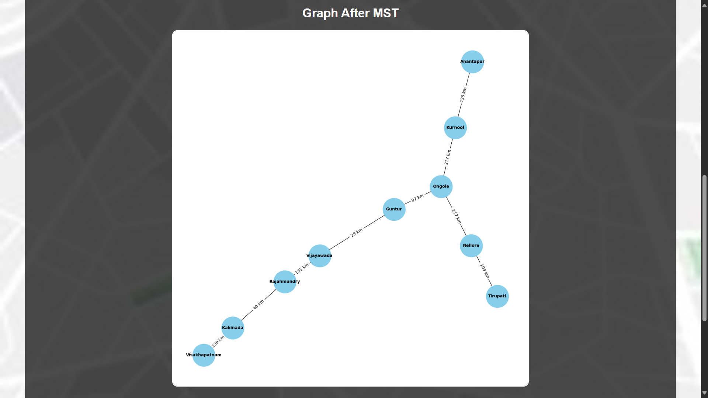
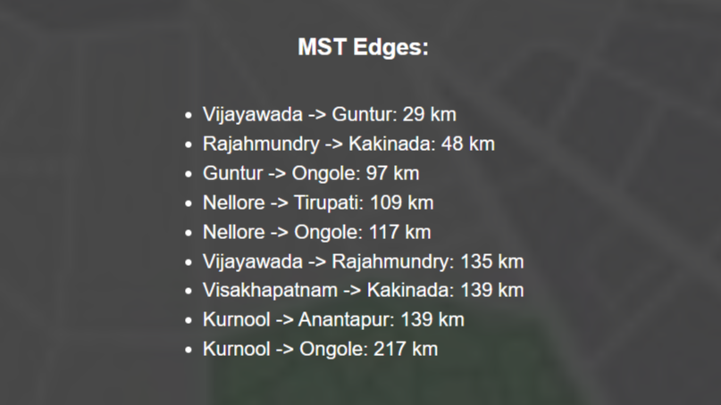

# MSTCityGraph - **Minimum Spanning Tree (MST) between Cities**

This project generates a **Minimum Spanning Tree (MST)** between a set of cities, providing the most cost-effective way to connect them. It uses **Graph Theory** and popular algorithms to create an optimal road, power, or communication network. The system draws the graph and visualizes the MST in an interactive manner, displaying the graph before and after the MST is generated along with the MST edges.

---

## **Table of Contents**

1. [Overview](#overview)
2. [Features](#features)
3. [Technologies Used](#technologies-used)
4. [Workflow](#workflow)
5. [MST Visualization](#mst-visualization-comparative-study)
6. [Installation Instructions](#installation-instructions)
7. [How to Use](#how-to-use)
8. [Screenshots](#screenshots)
9. [Real-World Applications](#real-world-applications)
10. [Conclusion](#conclusion)

---

## **Overview**

This system provides a way to generate and visualize the Minimum Spanning Tree (MST) between cities. After entering cities and the distances between them, the app will display:

1. The graph of cities **before** the MST.
2. The graph **after** the MST is applied.
3. The **MST edges** (the roads or connections selected by the MST algorithm).

This project can be applied to real-world problems such as road network design, power grid optimization, or travel route planning, where minimizing the total connection cost is crucial.

---

## **Features**

* **Interactive Graph Visualization**:

  * Visualize the graph of cities before and after generating the MST.
  * Displays the edges selected by the MST algorithm.

* **Customizable Input**:

  * Enter cities separated by commas, followed by the distances between them.

* **Graph Algorithms**:

  * Uses **Prim's Algorithm** or **Kruskal's Algorithm** to find the MST efficiently.

---

## **Technologies Used**

* **Python 3**: Backend logic and MST algorithms.
* **Flask**: Web framework for rendering templates and handling requests.
* **NetworkX**: Library for graph-related algorithms and visualization.
* **Matplotlib**: For drawing the MST graph.
* **Geopy**: To fetch geographical coordinates of cities for distance calculation.
* **HTML/CSS**: Frontend for rendering the user interface.
* **JavaScript**: For interactive elements (optional if you want to use it).

---
## Workflow



This diagram outlines the step-by-step process involved in constructing the Minimum Spanning Tree (MST) for a set of cities:

1. **Collect city data**: Users input city names, which are geocoded into coordinates.
2. **Preprocess data**: Clean and structure the data for graph creation.
3. **Graph construction**: A weighted graph is formed where cities are nodes and distances are edge weights.
4. **Apply MST algorithms**: Algorithms like Prim’s or Kruskal’s are used to compute the MST.
5. **Generate MST**: Extract the optimal edges that form the MST.
6. **Visualize MST**: Before and after comparison to show the impact of the MST.

---

## MST Visualization: Comparative Study

This section provides a visual and analytical comparison of the Minimum Spanning Trees (MSTs) generated using **Prim’s Algorithm** and **Kruskal’s Algorithm**. The graphs below show the city network **before and after** applying each algorithm.

### Using Prim’s Algorithm

| Before MST & After MST                                |
| ----------------------------------------------------- |
|  |

**Observation:**
Prim’s algorithm starts with an arbitrary node and grows the MST by adding the minimum weight edge connected to the current tree. This tends to produce a more locally optimized structure when node distribution is dense or clustered.

### Using Kruskal’s Algorithm

| Before MST & After MST                                      |
| ----------------------------------------------------------- |
|  |

**Observation:**
Kruskal’s algorithm sorts all edges by weight and adds them in order, avoiding cycles. It can handle disconnected graphs initially and is more efficient when edges are already sorted. It results in globally optimal edges regardless of starting point.

### Comparative Summary

| Criteria                    | Prim’s Algorithm                       | Kruskal’s Algorithm                         |
| --------------------------- | -------------------------------------- | ------------------------------------------- |
| Approach                    | Greedy, grows MST from a single vertex | Greedy, adds edges by weight globally       |
| Graph Requirement           | Connected graph                        | Can work with disconnected graphs initially |
| Edge Selection              | Based on adjacent nodes to tree        | Based on globally minimum weight edges      |
| Performance on Dense Graphs | Performs well                          | Slightly slower due to edge sorting         |
| Use Case                    | Suitable for dense graphs              | Suitable for sparse graphs                  |


### For In-Depth Analysis

Refer to the [Comparative study (PDF)](https://github.com/harshini-pokuru/MSTCityGraph/blob/main/Comparative%20study.pdf) or [Final_Report (PDF)](https://github.com/harshini-pokuru/MSTCityGraph/blob/main/Final_Report.pdf) for detailed methodology, time complexity analysis, and real-world application relevance.

---


## **Installation Instructions**

### **Prerequisites**

To run this project on your local machine, you need to install the following:

1. **Python 3.x**: [Download Python](https://www.python.org/downloads/)
2. **Pip**: Python's package installer (should be installed automatically with Python).

### **Steps to Set Up**

1. **Clone the Repository**:

   ```bash
   git clone https://github.com/harshini-pokuru/mst-between-cities.git
   cd mst-between-cities
   ```

2. **Create a Virtual Environment** (optional):

   ```bash
   python -m venv venv
   venv\Scripts\Activate  # On Windows 
   ```

3. **Install Required Libraries**:
   You need to install Flask and Geopy to run this project. Use the following commands to install them via pip:

   ```bash
   pip install flask geopy
   ```

4. **Run the Application**:

   ```bash
   python app.py
   ```

5. **Access the Application**:
   Open your browser and go to `http://127.0.0.1:5000/`.

---

## **How to Use**

1. **Enter Cities**:

   * On the homepage, you will be prompted to enter the **cities** separated by commas (e.g., City A, City B, City C).

2. **Generate the MST**:

   * After entering the cities, click on the **"Generate MST"** button.
   * The application will:

     * Display the **graph before MST**: Showing all cities connected by their respective distances.
     * Display the **graph after MST**: Showing only the roads selected by the MST algorithm.
     * List the **MST edges**: These are the edges that make up the minimum spanning tree.

4. **Interactive Visualization**:

   * The graphs will be drawn using **Matplotlib** or another visualization tool, displaying the nodes (cities) and edges (connections) clearly.
   * The MST will be highlighted in the graph, showing how the algorithm connects the cities with minimal cost.

5. **Applications**:

   * The result of the MST can be used for various practical applications like road network design, power grid optimization, delivery route planning, and more.

---

## **Screenshots**

* **Main Page**:
  

* **Graph Before MST**:
  

* **Graph After MST**:
  

* **MST Edges**:
  

---

## **Real-World Applications**

Here are several practical uses of the MST-based system:

### 🚗 **Road Network Design**

* **Use**: Design cost-effective road or railway networks that connect all cities with minimal total construction cost.
* **Why MST?**: The MST connects all cities with the shortest total path **without creating cycles**, minimizing infrastructure cost.

### 🌐 **Telecommunication & Power Grids**

* **Use**: Laying out cables (fiber optic, telephone, electricity) between locations.
* **Why MST?**: The MST ensures full connectivity with minimal wiring cost and no redundancy.

### 🗺️ **Map Applications (like Google Maps)**

* **Use**: Simplify maps by identifying the backbone routes connecting all cities efficiently.
* **Note**: MST does not find the shortest path between two cities but finds the **most efficient way to connect all cities** overall.

### 📦 **Logistics & Delivery Route Planning**

* **Use**: Design efficient depot-to-city connections to reduce transportation costs.
* **Example**: A delivery company connects all cities it serves from a central depot using the MST structure.

### 🧭 **Travel Route Planning**

* **Use**: Suggest a cost-efficient travel path for visiting multiple cities.
* **MST as Base**: It can serve as a starting point for solving the **Traveling Salesman Problem (TSP)** approximately.

### 🏙️ **Urban Planning & Infrastructure**

* **Use**: Plan water pipelines, sewage systems, or metro routes to minimize infrastructure costs.
* **Why MST?**: Reduces costs by connecting areas with the fewest possible connections.

### 🛡️ **Network Design in IT (LAN/WAN)**

* **Use**: Connect computers, data centers, or servers in the most efficient way to reduce cabling costs.
* **Why MST?**: MST optimizes the network topology, reducing the total cabling needed.

---

## **Conclusion**

This project demonstrates how to calculate the **Minimum Spanning Tree (MST)** for a set of cities, optimizing the connections between them. By using **Flask** for the web interface and **Geopy** for geographical location and distance calculations, the application provides a simple yet effective way to visualize city connections before and after constructing the MST.

With this tool, you can explore various real-world applications of MST, including **road network design**, **telecommunication and power grids**, **logistics**, **urban planning**, and more. The possibilities are vast, and the project offers an excellent foundation for anyone interested in graph theory, optimization problems, or city planning.

Feel free to explore the repository, modify the code, or even extend it with additional features such as interactive maps or further optimizations for specific use cases.

If you have any suggestions, feel free to open an issue or contribute to the repository!

---
